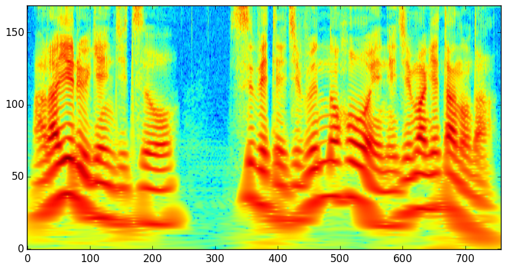

# ConstantQ

[](https://travis-ci.org/r9y9/ConstantQ.jl)
[](https://ci.appveyor.com/project/r9y9/constantq-jl/branch/master)
[](https://coveralls.io/r/r9y9/ConstantQ.jl?branch=master)

A fast constant-q transform in Julia



## High-level interface

```julia
X, timeaxis, freqaxis = cqt(x, fs)
```

where `x` is a input monoral signal and fs is its sampling frequency.

## Low-level interface

```julia
# Define geometrically-spaced frequency range to analyze
freq = GeometricFrequency(min=55, max=fs/2, bins=24)

# Create spectral kernel matrix
K = speckernel(Float64, fs, freq)

# Compute constant-q spectrogram
hopsize = convert(Int, round(fs * 0.005)) # 5ms hopsize
X, timeaxis, freqaxis = cqt(x, fs, K, hopsize=hopsize)
```

## References

- J. C. Brown and M. S. Puckette, "An efficient algorithm for the calculation of a constant Q transform," J. Acoust. Soc. Amer., vol. 92, no. 5, pp. 2698–2701, 1992.
- J. C. Brown. "Calculation of a constant Q spectral transform," Journal of the Acoustical Society of America,, 89(1): 425–434, 1991.
